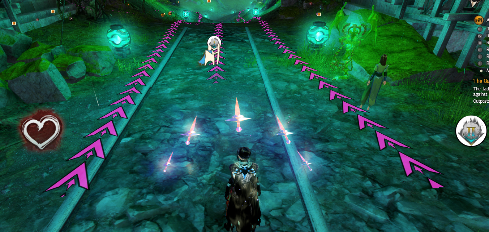
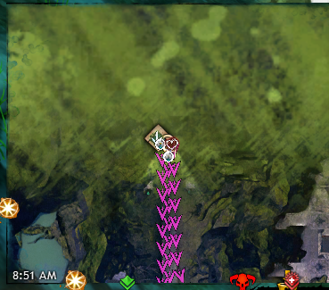
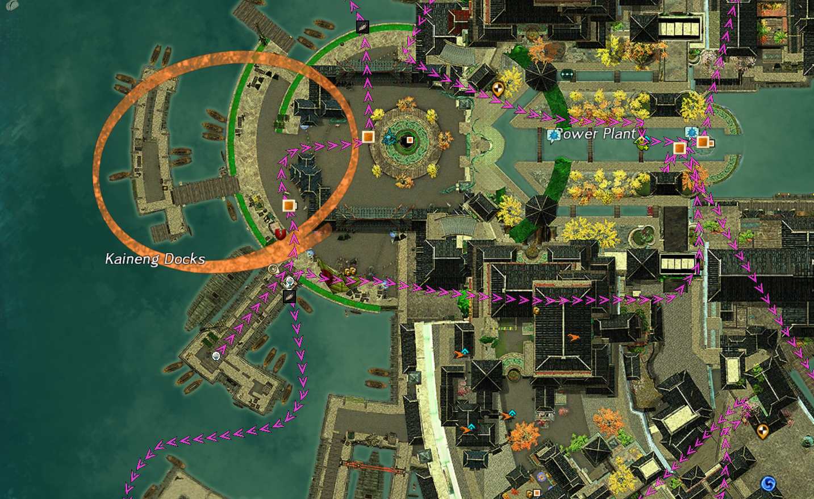
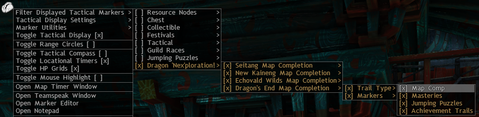
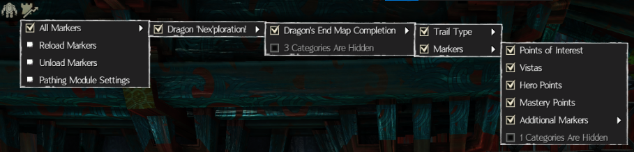

# Welcome to End of Dragons 'Nex'ploration! 

This marker and trail pack is for all y'all looking to map-comp all of Cantha and start building out those sweet new legendaries. I've also created a few extra trails as well, adding in mastery routes, JP's and some achievement routes. I may or may not add more routes in the future, just depends on personal time.

I won't always push a public release unless there have been substantial changes or additions made to the pack, however the most recent upload can be found [here](https://raw.githubusercontent.com/Nexrym/Nexploration/main/Nexploration.taco)

Enjoy~!

## Installation

To get this pack to work, simply drop it into (wherever you have taco located)\TACO\POIs folder and you'll be set to go.

For BlishHUD: Install the Pathing Module and place the taco file into \Documents\Guild Wars 2\addons\blishhud\markers

## In-game Screenshots

### Overlay

### Mini-map View

### Map View

### TACO Settings

### BlishHUD Settings

***

## Current status: Map-Comp'd

Pack contains total map completion for Cantha as well as some additional routes.

- Seitung
  - Map Completion Route
  - Mastery Route
  - JP Routes
  - Some Achievement Routes
- Kaineng
  - Map Completion Route
  - Mastery Route
  - JP Route
  - One Achievement Route
- Echovald
  - Map Completion Route
  - Mastery Route partially complete
  - Some Achievement Routes
- Dragon's End
  - Map Completion Route

***

## Credits

Made by Nex.2456

Thanks to xrandox (xTeh.7146) for creating TehsTrails and having well documented xml's which were heavily studied in preparation for making this pack, as well as GW2 TACO REACTIF for their incredibly helpful TACO file FAQ section.

Any art assets belonging to Guild Wars 2 are property of ArenaNet and are used only for creative purposes. plz no sue <3